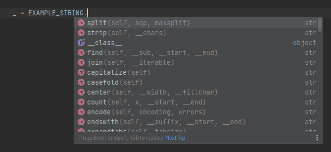

#############
Project goals
#############

The project aims to accomplish multiple goals.

Standards unification
=====================

The first goal is to allow easy integration of an application with multiple configuration standards, such as environment variables, dotenv files, and Docker Secrets files.

:mod:`cfig` achieves it by allowing the developers of an application to specify where and how configuration values should be loaded from.

.. code-block:: python

    import cfig
    import cfig.sources

    config = cfig.Configuration(
        sources=[
            cfig.sources.EnvironmentSource(),
            cfig.sources.EnvironmentSource(prefix="DEV" if __debug__ else "PROD"),
            ...
        ],
    )

Developer-friendliness
======================

The second goal is to provide a simple and Pythonic interface for developers to define and consume their configuration.

:mod:`cfig` tries to achieve that by employing decorators and functions to create a declarative interface.

.. code-block:: python

    @config.required()
    def SECRET_TOKEN(val: str) -> str:
        """
        The token used to encrypt messages. Keep it secret at all costs!
        """
        if val.startswith("v1"):
            raise cfig.InvalidValueError("Old token, only v2 tokens are supported")
        elif not val.startswith("v2"):
            raise cfig.InvalidValueError("Unknown token version")
        else:
            return val

.. code-block:: python

    from .mycfig import SECRET_TOKEN

    print(f"This is my secret token: {SECRET_TOKEN}. Don't mention it to anybody!")

User-friendliness
=================

Another goal is to simplify deployments for system administrators, providing informative error messages and hints to the user configuring the application.

:mod:`cfig` does that by providing a CLI displaying all possible configuration keys, their docstrings and their values.

.. code-block:: python

    if __name__ == "__main__":
        config.cli()

.. code-block:: console

    $ python -m mycfig
    ===== Configuration =====

    SECRET_TOKEN → Required, but not set.
    The token used to encrypt messages. Keep it secret at all costs!

    ===== End =====
    $ SECRET_TOKEN="v1:potato" python -m mycfig
    ===== Configuration =====

    SECRET_TOKEN → Old token, only v2 tokens are supported
    The token used to encrypt messages. Keep it secret at all costs!

    ===== End =====
    $ SECRET_TOKEN="v2:qwertyasdf" python -m mycfig
    ===== Configuration =====

    SECRET_TOKEN = "v2:qwertyasdf"
    The token used to encrypt messages. Keep it secret at all costs!

    ===== End =====

Developer hints
===============

The last goal of :mod:`cfig` is having complete and useful typing, so that developer tools may provide correct and useful type hints on configuration values.

:mod:`cfig` currently does that, albeit using a few hacks to hide the true nature of configurable values.

