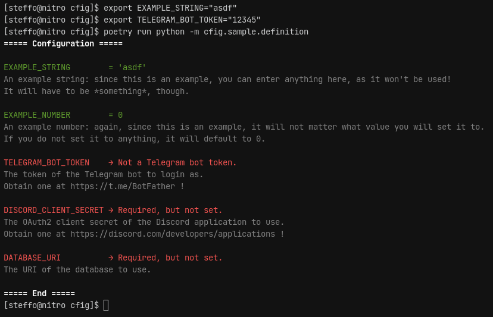

####
cfig
####

The :mod:`cfig` package provides a simple but powerful configuration manager for Python applications.

Pitch
=====

Ever had trouble making your application configurable?
Ever fought with global objects which impeded code reuse?
Ever had a confused user ask you how to configure your application?
In that case, :mod:`cfig` is for you!

Minimal example
===============

.. image:: example-definition.png

.. image:: example-usage.png

Table of contents
=================

.. toctree::

    goals
    installation
    quickstart
    reference
    glossary

Other tables and links
======================

* :ref:`genindex`
* :ref:`modindex`
* :ref:`search`
