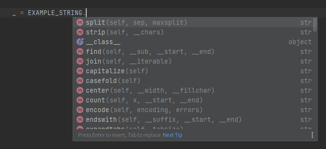

####
cfig
####

The :mod:`cfig` package provides a simple but powerful configuration manager for Python applications.

Goals
=====

A goal is to allow easy integration of an application with multiple configuration standards, such as environment
variables, dotenv files, and Docker Secrets files.

.. code-block:: python

    @config.required()
    def SECRET_KEY(val: str) -> str:
        "Secret string used to manage tokens."
        return val

Another goal is to provide informative error messages to the user who is configuring the application, so that they may
understand what they are doing wrong and fix it immediately.

.. code-block:: console

    $ python -m cfig.sample
    === Configuration ===

    SECRET_KEY    → Required, but not set.
    Secret string used to manage HTTP session tokens.

    HIDDEN_STRING = 'amogus'
    A string which may be provided to silently print a string to the console.

Finally, the last goal is having useful typing for developers using :mod:`cfig`, allowing them to make full use of the
features of their IDEs.

Example
=======

If you'd like to learn how to use :mod:`cfig` hands-on,
read `the source code of the cfig.sample module <https://github.com/Steffo99/cfig/tree/main/cfig/sample>`_!

Pages of this documentation
===========================

.. toctree::

    terminology
    reference

Other tables and links
======================

* :ref:`genindex`
* :ref:`modindex`
* :ref:`search`
